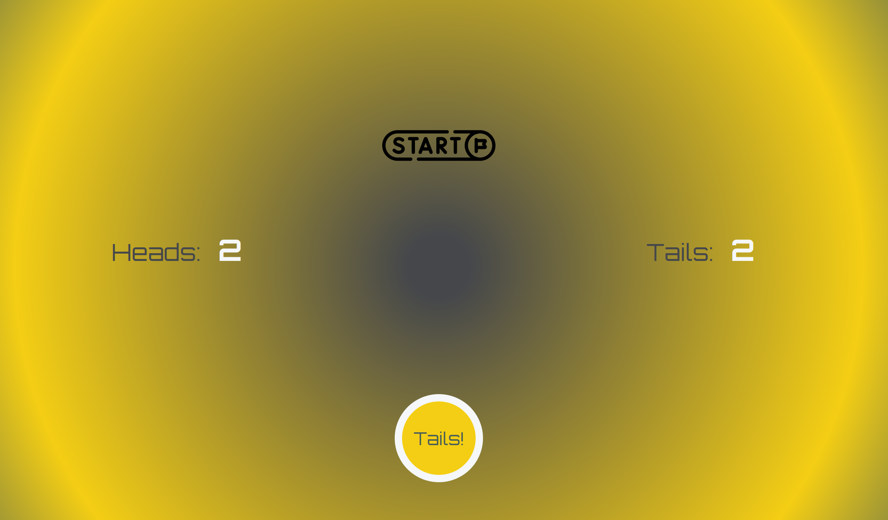

# Flip a Coin Game



This is a simple **Flip a Coin** game made with **JavaScript**, **HTML**, and **CSS**.  
I built it as a practice project to improve my skills in:

- JavaScript functions and DOM manipulation
- Working with Git and GitHub
- Building user interfaces

---

## How It Works

Click the "Flip Coin" button and the game will randomly show either "Heads" or "Tails".  
It also keeps a record of how many times each result occurred.

---

## Pseudocode

FUNCTION coinFlip(count): CREATE object to store results and counts LOOP from 0 to count: GENERATE a random number (1 or 2) IF number is 1: ADD "Heads" to record INCREMENT heads count ELSE: ADD "Tails" to record INCREMENT tails count RETURN the result object

---

## What I Learned

- How to use `Math.random()` and conditionals to simulate randomness
- How to manipulate the DOM to update results
- How to use Git to track changes
- How to push a project to GitHub and write a good README

---

## Credits

The original coin flip logic was based on this code snippet:

```javascript
function coinFlip(count) {
  var obj = { record: [], headsCount: 0, tailsCount: 0 };
  for (var i = 0; i < count; i++) {
    if (Math.floor(Math.random() * 2 + 1) === 1) {
      obj.record.push("Heads");
      obj.headsCount++;
    } else {
      obj.record.push("Tails");
      obj.tailsCount++;
    }
  }
  return obj;
}
```

Icon from:
[_Start button icons created by Freepik - Flaticon_](https://www.flaticon.com/free-icons/start-button)
